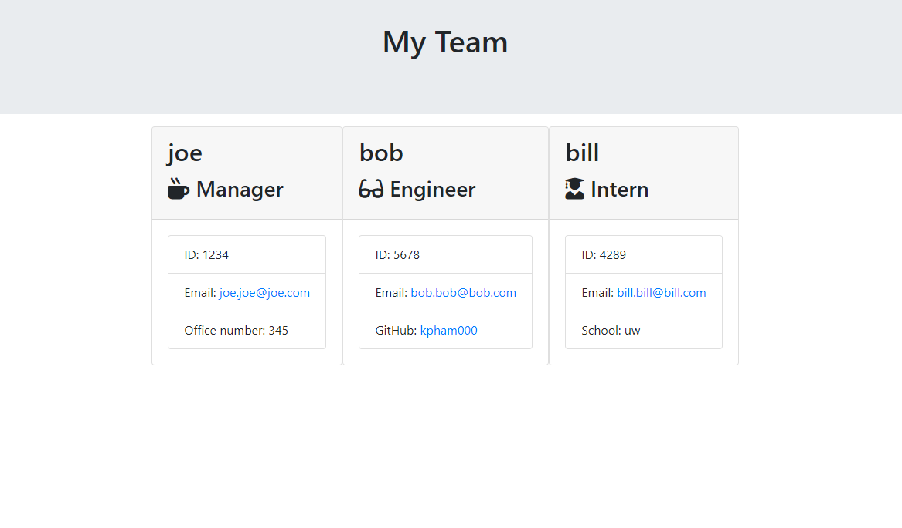

# team-profile-generator

## Description:
Create a webpage that displays each employees profile. The information that should be displayed are their roles, employee IDs, emails, school and, github profile. Use jest for testing and inquirer for user input. The Manager should be able to see several employee profiles displayed on webpage at once. 

## Tech used:
JavaScript
Jest
Node.js
Inquirer

## Usage:

Display of what page looks like:

## Video:
https://watch.screencastify.com/v/3n2BBzRWXjwNqin3n650

## GitHub:

https://github.com/kpham000

